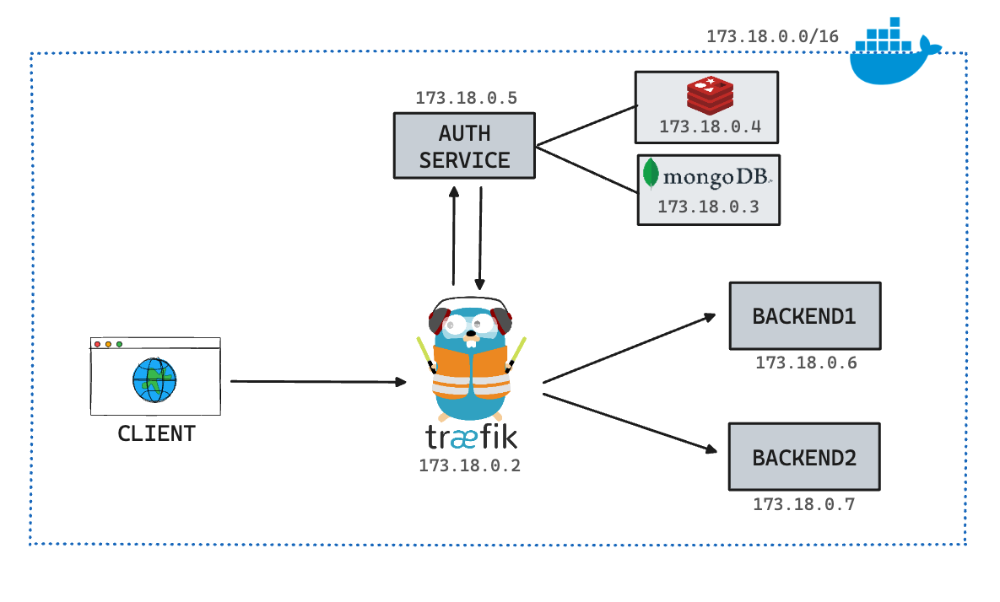

# Traefik Auth API Gateway



## Project Overview

This project demonstrates how to use Traefik as a gateway and implement an authentication system using Docker and Docker Compose. It sets up a Traefik reverse proxy to route requests to different backend services and an authentication service that verifies user credentials. The setup includes a MongoDB database, Redis, and multiple backend services.

## Features

- **Traefik Reverse Proxy**: Acts as a gateway to route requests to backend services.
- **Authentication Service**: Validates user credentials using MongoDB and Redis.
- **Multiple Backends**: Serves different backend services behind the Traefik gateway.
- **Middleware for Authentication**: Ensures that requests are authenticated before reaching the backend services.

## Architecture

The architecture consists of the following services:

- **Traefik**: Handles routing, load balancing, and TLS termination.
- **MongoDB**: Stores user data for the authentication service.
- **Redis**: Caching and session storage for the authentication service.
- **Auth Service**: Manages user authentication and token validation.
- **Backend Services**: Two HTTP servers that serve content.

## Docker Compose Configuration

### Services

- **traefik**:

  - Uses the `traefik:v2.5` image.
  - Exposes ports 80, 443, and 8080.
  - Configured to use Docker as a provider.
  - Configured to handle both HTTP and HTTPS traffic.

- **mongo**:

  - Uses the `mongo:latest` image.
  - Exposes port 27018.
  - Persists data using a Docker volume.

- **redis**:

  - Uses the `redis:latest` image.
  - Exposes port 6380.

- **auth-service**:

  - Built from the `./auth-service` directory.
  - Configured with environment variables for MongoDB, Redis, JWT key, and port.
  - Depends on MongoDB and Redis.
  - Exposes port 3000 for external access.

- **backend1**:

  - Uses the `httpd:alpine` image.
  - Serves content from `./backend1.html`.
  - Configured to require authentication.

- **backend2**:

  - Uses the `httpd:alpine` image.
  - Serves content from `./backend2.html`.
  - Configured to require authentication.

- **auth-middleware**:
  - Uses the `traefik:v2.5` image.
  - Configured to use the authentication service for request validation.

### Networks

- **traefik-net**:
  - Custom bridge network with a specified subnet.
  - Ensures that all services can communicate with each other.

## Usage

### Steps to Run

1. Build and start the containers:

```bash
docker-compose up --build
```

2. Access the Traefik dashboard:

- Open your browser and navigate to `http://localhost:8080`.

3. Access the backend services:

- Backend 1: `http://backend.localhost`
- Backend 2: `http://backend.localhost`

4. Authentication:

- The `auth-service` handles authentication. Requests to `backend1` and `backend2` will be authenticated through the `auth-middleware`.

### Environment Variables

- `MONGODB_URL`: MongoDB connection string.
- `REDIS_ADDR`: Redis connection string.
- `JWT_KEY`: Secret key for JWT.
- `PORT`: Port for the auth service.

### Traefik Configuration

- **EntryPoints**:

  - `web`: Handles HTTP traffic on port 80.
  - `websecure`: Handles HTTPS traffic on port 443.

- **Middleware**:
  - `auth-middleware`: Uses the auth service to validate requests.

## Authentication System

The authentication system is implemented in Go and utilizes MongoDB, Redis, and JWT for handling user authentication, registration, and token validation. The Go code includes various handlers to manage these processes and integrate with Traefik.

### Usage Scenarios

#### 1. Registering a New User

**Endpoint**: `POST /register`

**Description**: Registers a new user by storing their email and hashed password in MongoDB.

**Request Body**:

```json
{
	"email": "user@example.com",
	"password": "user_password"
}
```

**Response**:

- **201 Created**: User registered successfully.
- **409 Conflict**: User already exists.
- **400 Bad Request**: Invalid request body.
- **500 Internal Server Error**: Error during registration.

**Example**:

```bash
curl -X POST http://localhost:3000/register -H "Content-Type: application/json" -d '{"email":"user@example.com", "password":"user_password"}'
```

#### 2. Logging in a User

**Endpoint**: `POST /login`

**Description**: Logs in a user by verifying their credentials and generating JWT access and refresh tokens.

**Request Body**:

```json
{
	"email": "user@example.com",
	"password": "user_password"
}
```

**Response**:

- **200 OK**: Login successful, tokens set in cookies.
- **401 Unauthorized**: Invalid credentials.
- **400 Bad Request**: Invalid request body.
- **500 Internal Server Error**: Error during login.

**Example**:

```bash
curl -X POST http://localhost:3000/login -H "Content-Type: application/json" -d '{"email":"user@example.com", "password":"user_password"}'
```

#### 3. Validating an Access Token

**Endpoint**: `GET /validate`

**Description**: Validates the JWT access token provided in the Authorization header.

**Request Header**:

```
Authorization: Bearer <access_token>
```

**Response**:

- **200 OK**: Token is valid.
- **401 Unauthorized**: Invalid or expired token.

**Example**:

```bash
curl -X GET http://localhost:3000/validate -H "Authorization: Bearer <access_token>"
```

#### 4. Refreshing an Access Token

**Endpoint**: `POST /refresh`

**Description**: Refreshes the JWT access token using the refresh token stored in the cookies.

**Request Cookies**:

- `refresh_token`: The refresh token stored in the cookies during login.

**Response**:

- **200 OK**: New access token issued.
- **401 Unauthorized**: Invalid or expired refresh token.
- **500 Internal Server Error**: Error during token refresh.

**Example**:

```bash
curl -X POST http://localhost:3000/refresh --cookie "refresh_token=<refresh_token>"
```

### Explanation of Key Components

1. **Environment Variables**:

   - `JWT_KEY`: Secret key for signing JWT tokens.
   - `MONGODB_URL`: MongoDB connection string.
   - `REDIS_ADDR`: Redis connection string.
   - `PORT`: Port on which the authentication service listens.

2. **Database Connections**:

   - `connectToMongoDB()`: Establishes a connection to MongoDB.
   - `connectToRedis()`: Establishes a connection to Redis.

3. **Handlers**:

   - `registerHandler`: Handles user registration.
   - `loginHandler`: Handles user login and token generation.
   - `validateHandler`: Validates JWT access tokens.
   - `refreshHandler`: Refreshes JWT access tokens using refresh tokens.

4. **JWT Token Generation and Validation**:

   - `jwt.New(jwt.SigningMethodHS256)`: Creates a new JWT token.
   - `token.SignedString(jwtKey)`: Signs the JWT token with the secret key.
   - `jwt.Parse(tokenString, func(token *jwt.Token) (interface{}, error) {...})`: Parses and validates the JWT token.

5. **Middleware Integration with Traefik**:
   - Traefik uses the `/validate` endpoint to validate tokens before forwarding requests to backend services.
   - The `auth-middleware` service in the Docker Compose configuration handles this integration.
